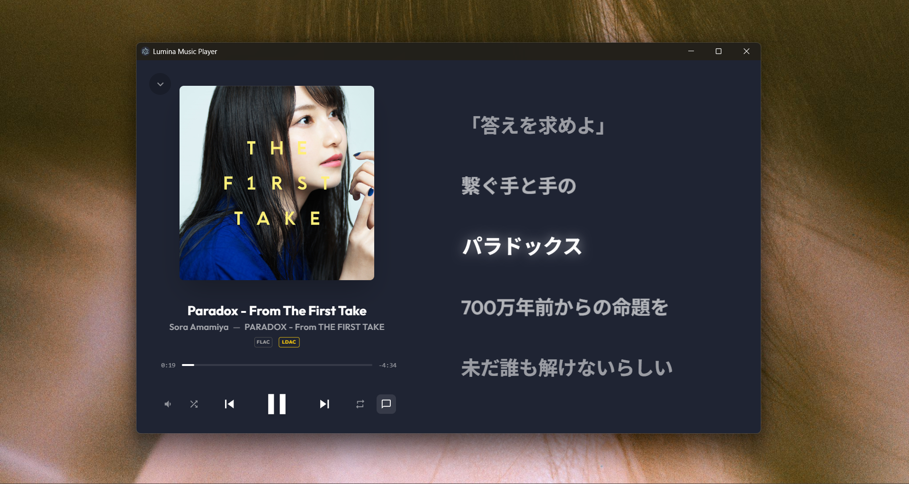

# LuminaPlayer

Minimalist music player with synchronized lyrics and high-res audio support.


Windows App:


Discord Rich Presence:


## Features

- **Local Library:** Import audio files, folders, and manage them with persistent metadata.
- **High-Res Audio:** **LDAC** software decoding support for high-fidelity Bluetooth playback on Windows.
- **Context-Aware Playback:** Queue system allowing playback from specific Albums, Artists, or the Global Queue.
- **Smart Metadata:** Background metadata extraction with **music-metadata**.
- **Performance:** Optimized cover art caching (file-based) for instant library loading.
- **Synced Lyrics:** Auto-fetch synchronized lyrics from [lrclib.net](https://lrclib.net) with Gemini AI fallback.
- **Visualizer:** Real-time audio frequency visualizer.
- **Discord Rich Presence:** Show your current track and playback status on Discord.

## Tech Stack

- **Frontend:** React 19 + TypeScript + Vite
- **Styling:** Tailwind CSS
- **Desktop:** Electron (IPC architecture)
- **Audio Processing:** 
    - `music-metadata` (Metadata & Duration)
    - Custom Native LDAC Module
- **Storage:** File-based cover caching & JSON configuration

## Project Structure

```text
electron/
  main.cjs               # Main Process (IPC, Metadata, File System)
  preload.cjs            # Preload script
app/
  components/            # React UI components (Library, Player, Visualizer)
  hooks/                 # Custom Hooks (useAudio, useLibrary, useLyrics)
  services/              # Services (Gemini, Metadata Fallback)
  App.tsx                # Main Application Logic
native/
  ldac/                  # LDAC Codec Integration
```

## Run Locally

**Prerequisites:** Node.js (v18+)

1. Install dependencies:
   ```bash
   npm install
   ```

2. Create `.env` and add your keys (Optional):
   ```env
   DISCORD_CLIENT_ID=YOUR_CLIENT_ID_HERE
   ```

3. Run the app (Development Mode):
   ```bash
   npm run dev
   # To launch Electron window:
   npm run electron:dev
   ```

## Build Desktop App

Build the Windows desktop application:

```bash
npm run electron:build:win
```

The installer will be generated in the `release/` folder.
